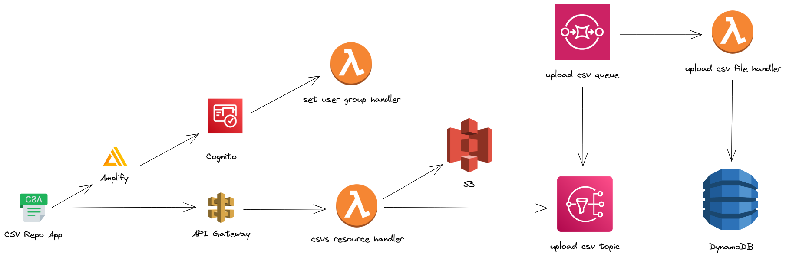

# CSV Repo

**_App Link_**: [https://d3i442e6zsckr8.cloudfront.net/](https://d3i442e6zsckr8.cloudfront.net/).

# Architecure Diagram



# Solution

## [Amplify](https://us-east-2.admin.amplifyapp.com/admin/dctxhdvui221r/staging/home)

Most things start from here. I created an Amplify application which I set up most other services from (e.g. S3). This is why some of my services have names that look like they are generated by a program. Though the only thing I use through Amplify is [AWS Cognito](https://us-east-2.console.aws.amazon.com/cognito/v2/idp/user-pools/us-east-2_aVG8F7xNY/users?region=us-east-2) for authentication, where I use [@aws-amplify/ui-vue](https://www.npmjs.com/package/@aws-amplify/ui-vue) to display an authentication component that uses amplify frontend APIs to communicate with AWS Cognito for authentication.

## [Lambda Function: Set User Group Handler](https://us-east-2.console.aws.amazon.com/lambda/home?region=us-east-2#/functions/obadaSetUserDefaultGroup-staging?tab=code)

A function that is triggered when a user is created in AWS Cognito to set the default group for the user, which is the `full-access` group.

An admin must access the [Cognito Pool page](https://us-east-2.console.aws.amazon.com/cognito/v2/idp/user-pools/us-east-2_aVG8F7xNY/groups?region=us-east-2) to change the group for a user.

## [API Gateway](https://us-east-2.console.aws.amazon.com/apigateway/home?region=us-east-2#/apis/d4yjhv4zz5/resources/4waktni7h4)

The API gateway is configured to call the CSV resource handler lambda function for any request.

## [Lambda Function: CSV Resource Handler](https://us-east-2.console.aws.amazon.com/lambda/home?region=us-east-2#/functions/csvResourceHandler-staging?tab=code)

The application logic is written as an express app unaware of its architectural context, a lambda function, and then an abstraction layer, particularly, [aws-serverless-express](https://www.npmjs.com/package/aws-serverless-express), is used in the lambda function handler to direct the request to the correct controller.

This design has been useful, not only because the architecture is cleaner with not much fuss caused by the many to-be lambda functions, but also because the application logic was written as a traditional app, freeing me from having to handle some tricky parts if I were to create a lambda function for each controller, like authorization.

Here is a sample code showing how authorization is handled in my app:

```jsx
const express = require('express')

function authorize(allowedGroups) {
  return async (req, res, next) => {
    const [_, token] = req.headers.authorization.split('Bearer ')
    try {
      await cognitoJwtVerifier.verify(token, {
        tokenUse: null,
        clientId: null,
        groups: allowedGroups
      })
      next()
    } catch {
      res.status(401).end()
    }
  }
}

app.get('/csv', authorize(['full-access', 'read-write-access', 'read-access']), (req, res) => {
  // logic ..
})
```

## [S3](https://s3.console.aws.amazon.com/s3/buckets/obada-csv-repo-storage141255-staging)

Used by the CSV resource handler lambda function through the AWS JS SDK to upload files to.

## [SQS](https://us-east-2.console.aws.amazon.com/sqs/v2/home?region=us-east-2#/queues/https%3A%2F%2Fsqs.us-east-2.amazonaws.com%2F376353728436%2Fobada-encryption-decryption-queue)/[SNS](https://us-east-2.console.aws.amazon.com/sns/v3/home?region=us-east-2#/topic/arn:aws:sns:us-east-2:376353728436:upload-csv-file-to-db)/[DynamoDB](https://us-east-2.console.aws.amazon.com/dynamodbv2/home?region=us-east-2#tables)

SQS is Treated as a thread that the CSV resource handler sends requests to, to load the uploaded CSV files to DynamoDB as a table by publishing to an SNS topic that the queue is subscribed to.

The CSV files’ tables uploaded by my application start with “obada_csv_repo”.

# Confessions:

- The SQS queue name is incorrect, and I realized that at the end of the assignment and didn't have (بتع) enough to fix it :)
- In my lambda functions there are many places where I should use environment variables to hide secret values but I didn't :)
- I have a bug where if you try to upload a file with a name that already exists will cause its DynamoDB table to be created and deleted endlessly. Not sure why, but I think it has something to do with the queue storing old files names and sending them to the lambda handler.
